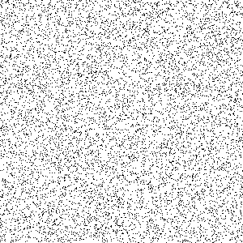

# Physics-based N-body Simulation with CUDA

This repository contains implementations of a gravitational N-body simulation for the Physics-based Animation course at The University of Tokyo. The simulation demonstrates gravitational interactions between particles in a 2D space, with both brute-force and grid-based acceleration methods.

## Implementations

This project provides two different implementations of the same N-body algorithm:

1. **C++ Implementation** (`main.cpp`) - CPU-based implementation
2. **CUDA Implementation** (`main.cu`) - GPU-accelerated implementation using CUDA

## Simulation Overview

The simulation models gravitational interactions between particles in a 2D space:

- Particles are randomly distributed in a box with initial velocities
- Gravitational forces are calculated between all particles
- Time integration is performed using the leap-frog method
- Results are visualized as PPM format images

## Acceleration Methods

Two computational methods are implemented:

1. **Brute-Force** - Calculates interactions between all particle pairs with O(N²) complexity
2. **Grid-Based Acceleration** - Uses a spatial grid to separate near-field and far-field forces, reducing computational complexity

Note: In the current CUDA implementation, the grid-based acceleration method may actually be slower than the brute-force approach due to memory access patterns and thread divergence in the GPU. The theoretical advantages of the grid-based method are offset by GPU-specific implementation challenges.

## Visualization

The simulation generates output files that visualize the particle motion:



*Visualization of particles moving under gravitational forces*

## Usage

### Building the Project

```bash
mkdir -p build
cd build
cmake ..
make
```

### Running the Simulation

```bash
# Run with default settings (1000 particles, brute-force method)
./tinycuda

# Run with 10000 particles
./tinycuda --num-particle 10000

# Run with grid-based acceleration (note: may be slower on GPU)
./tinycuda --accelerate

# Run with both options
./tinycuda --num-particle 10000 --accelerate
```

## Performance Characteristics

- The CUDA implementation significantly improves performance for large numbers of particles when using the brute-force method.
- The grid-based acceleration in the CUDA implementation currently shows suboptimal performance due to:
  - Thread divergence in conditional branches
  - Inefficient memory access patterns
  - Atomic operation overhead
  - Additional kernel calls and memory operations

## Requirements

- CMake 3.28 or higher
- CUDA Toolkit
- C++17 compatible compiler